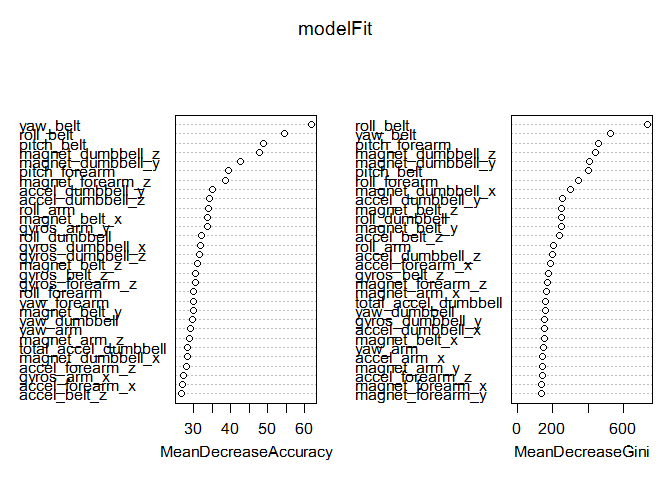

## Human Activity Recognition

### Introduction

Using devices such as _Jawbone Up_, _Nike FuelBand_, and _Fitbit_ it is now possible to collect a large amount of data about personal activity relatively inexpensively. These type of devices are part of the quantified self movement - a group of enthusiasts who take measurements about themselves regularly to improve their health, to find patterns in their behavior, or because they are tech geeks. One thing that people regularly do is quantify how much of a particular activity they do, but they rarely quantify how well they do it. In this project, your goal will be to use data from accelerometers on the belt, forearm, arm, and dumbell of 6 participants. They were asked to perform barbell lifts correctly and incorrectly in 5 different ways. More information is available from the website here: [http://groupware.les.inf.puc-rio.br/har](http://groupware.les.inf.puc-rio.br/har)

### Objective

Develop a machine learning algorithm with the variables content in the training dataset ('pml-training') and how they interact to get the result ("classe"), and apply this algorithm to each of the 20 test cases in the testing dataset ('pml_testing')

### Data

The data for this project come from this source: [http://groupware.les.inf.puc-rio.br/har](http://groupware.les.inf.puc-rio.br/har).

The training data for this project are available here: [pml-training.csv](https://d396qusza40orc.cloudfront.net/predmachlearn/pml-training.csv), and the test data are available here: [pml-testing.csv](https://d396qusza40orc.cloudfront.net/predmachlearn/pml-testing.csv)


```r
  library(caret)
```

```
## Loading required package: lattice
## Loading required package: ggplot2
```

```r
  set.seed(1234)

#  download.file(url="https://d396qusza40orc.cloudfront.net/predmachlearn/pml-training.csv",
#                destfile="pml-training.csv", method="internal")
#  download.file(url="https://d396qusza40orc.cloudfront.net/predmachlearn/pml-testing.csv",
#                destfile="pml-testing.csv", method="internal")
  pml_training <- read.csv("pml-training.csv",
                       na.strings=c("", "NA", "#DIV/0!"),
                       stringsAsFactors=TRUE)
  pml_testing  <- read.csv("pml-testing.csv",
                       na.strings=c("", "NA", "#DIV/0!"),
                       stringsAsFactors=TRUE)
```

#### Data analysis

First, we divided the training data ('pml-training.csv') in two chunks: training (60% of data) and testing (remaining 40%) for further testing of selected model.


```r
  inTrain <- createDataPartition(y=pml_training$classe,
                                 p=0.60, list=FALSE)
  training <- pml_training[ inTrain, ]
  testing  <- pml_training[-inTrain, ]

  table(testing$classe)
```

```
## 
##    A    B    C    D    E 
## 2232 1518 1368 1286 1442
```

```r
#  head(training)
#  summary(training)
```

There are 100 variables (of 160) with hign number of missing values (11540+ of 11776 records = 98%)


```r
  NAs <- vector(length=ncol(training))
  for(i in 1:ncol(training)) NAs[i]<- sum(is.na(training[, i]))
  table(factor(NAs))
```

```
## 
##     0 11535 11537 11541 11542 11560 11582 11583 11584 11776 
##    60    69     5     2     5     2     2     7     2     6
```

```r
  dim(training)
```

```
## [1] 11776   160
```

Since these variables do not influence the result, we will remove them along with some invariants ('new_window') and descriptive variables ('user_name', for example)


```r
# Remove columns with NAs
  training <- training[,!sapply(training,function(x) any(is.na(x)))]
  dim(training)
```

```
## [1] 11776    60
```

```r
  nZvar <- nearZeroVar(training, saveMetrics=TRUE)

  # After removing columns with NAs, there are one with near-zero variance:
  head(nZvar[order(nZvar$nzv, decreasing=TRUE), ], n=5L)
```

```
##                      freqRatio percentUnique zeroVar   nzv
## new_window           47.863071    0.01698370   FALSE  TRUE
## X                     1.000000  100.00000000   FALSE FALSE
## user_name             1.066543    0.05095109   FALSE FALSE
## raw_timestamp_part_1  1.035714    7.09918478   FALSE FALSE
## raw_timestamp_part_2  1.000000   90.71841033   FALSE FALSE
```

```r
  # There are columns that, by their nature, do not influence the resulting value:
  # raw_timestamp_part_1  raw_timestamp_part_2  cvtd_timestamp

  # Other variables are not related with the resulting:
  # X                     user_name             new_window            num_window

  # Remove this columns
  training <- training[ , -c(1:7)]   # This variables correspond to the first
                                     # 7 variables of the dataframe
```

#### Model Train

We selected Breiman and Cutler's Random Forest algorithm for prediction due to the accuracy of results.

First, we used the implementation of Random Forest in `train()` function:

```
  modelFit <- train(classe ~ ., data=training, method="rf")
  pred <- predict(modelFit, testing)
  table(pred, testing$classe)
  
# pred    A    B    C    D    E
#    A 2231   14    0    0    0
#    B    1 1499    7    1    0
#    C    0    4 1352   10    4
#    D    0    1    9 1274    2
#    E    0    0    0    1 1436

```

but the processing speed was a real con (more than 4 hours and a half). Finally, we used the `randomForest()` function of randomForest library:


```r
  library(randomForest)

  modelFit <- randomForest(classe ~ ., data=training, importance=TRUE)
  modelFit
```

```
## 
## Call:
##  randomForest(formula = classe ~ ., data = training, importance = TRUE) 
##                Type of random forest: classification
##                      Number of trees: 500
## No. of variables tried at each split: 7
## 
##         OOB estimate of  error rate: 0.59%
## Confusion matrix:
##      A    B    C    D    E class.error
## A 3342    5    0    0    1 0.001792115
## B   10 2266    3    0    0 0.005704256
## C    0   19 2031    4    0 0.011197663
## D    0    0   20 1909    1 0.010880829
## E    0    0    1    6 2158 0.003233256
```

```r
  varImpPlot(modelFit)   # Show more important variables
```

 

with a gain in speed and accuracy.

#### Model Validation


```r
  pred <- predict(modelFit, testing)
  table(pred, testing$classe)
```

```
##     
## pred    A    B    C    D    E
##    A 2229   12    0    0    0
##    B    3 1503   14    0    0
##    C    0    3 1350   23    1
##    D    0    0    4 1260    5
##    E    0    0    0    3 1436
```

```r
  print(confusionMatrix(pred, testing$classe))
```

```
## Confusion Matrix and Statistics
## 
##           Reference
## Prediction    A    B    C    D    E
##          A 2229   12    0    0    0
##          B    3 1503   14    0    0
##          C    0    3 1350   23    1
##          D    0    0    4 1260    5
##          E    0    0    0    3 1436
## 
## Overall Statistics
##                                          
##                Accuracy : 0.9913         
##                  95% CI : (0.989, 0.9933)
##     No Information Rate : 0.2845         
##     P-Value [Acc > NIR] : < 2.2e-16      
##                                          
##                   Kappa : 0.989          
##  Mcnemar's Test P-Value : NA             
## 
## Statistics by Class:
## 
##                      Class: A Class: B Class: C Class: D Class: E
## Sensitivity            0.9987   0.9901   0.9868   0.9798   0.9958
## Specificity            0.9979   0.9973   0.9958   0.9986   0.9995
## Pos Pred Value         0.9946   0.9888   0.9804   0.9929   0.9979
## Neg Pred Value         0.9995   0.9976   0.9972   0.9960   0.9991
## Prevalence             0.2845   0.1935   0.1744   0.1639   0.1838
## Detection Rate         0.2841   0.1916   0.1721   0.1606   0.1830
## Detection Prevalence   0.2856   0.1937   0.1755   0.1617   0.1834
## Balanced Accuracy      0.9983   0.9937   0.9913   0.9892   0.9977
```

Results show a 99.3% of accuracy in our test dataset.


### Test Set Prediction

Apply the machine learning algorithm built to each of the 20 test cases in the testing data set ('pml_testing'):


```r
  answers <- predict(modelFit, pml_testing)
  answers
```

```
##  1  2  3  4  5  6  7  8  9 10 11 12 13 14 15 16 17 18 19 20 
##  B  A  B  A  A  E  D  B  A  A  B  C  B  A  E  E  A  B  B  B 
## Levels: A B C D E
```

and generate the answer files


```r
  pml_write_files = function(x){
    n = length(x)
    for(i in 1:n){
      filename = paste0("problem_id_",i,".txt")
      write.table(x[i],file=filename,quote=FALSE,row.names=FALSE,col.names=FALSE)
    }
  }
  
  pml_write_files(as.character(answers))
```
